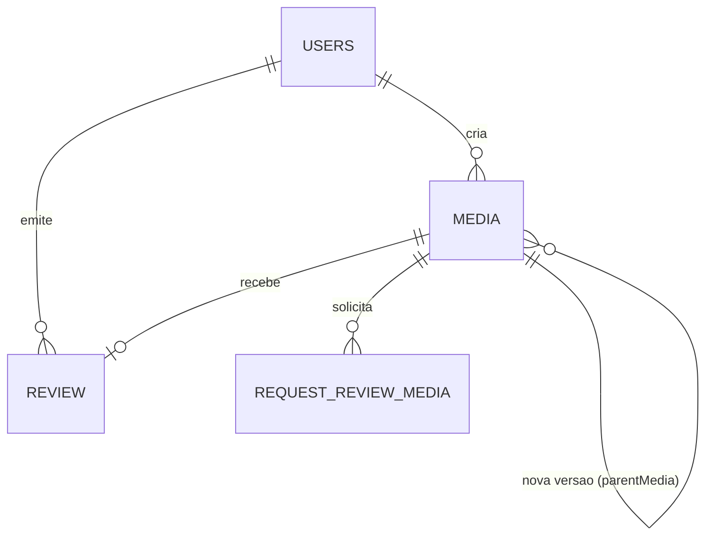

# VeriMedia API

API REST para registrar a procedência de conteúdos digitais e tornar transparente o uso de inteligência artificial em imagens, vídeos, áudios ou documentos.

O sistema permite que um criador cadastre uma mídia, declare como ela foi produzida e solicite uma verificação. Usuários autorizados revisam a declaração, e qualquer pessoa com o link público pode consultar informações selecionadas — incluindo a verificação de integridade do arquivo — sem expor dados privados.

---

## O problema que resolve

Com a popularização de ferramentas de IA generativa, ficou mais difícil entender a origem de uma mídia: ela foi criada por uma pessoa, gerada por IA ou sofreu modificação artificial?

O VeriMedia não promete detectar deepfakes automaticamente. Ele cria uma **trilha de confiança**: registra a declaração do criador, protege a integridade do arquivo com hash e mantém um processo de revisão por verificadores.

## Funcionalidades

- **Registro de procedência**: origem humana, assistida por IA, gerada por IA ou manipulada por IA
- **Integridade**: hash SHA-256 calculado no upload; qualquer pessoa pode verificar se o arquivo foi alterado
- **Versionamento append-only**: alterar uma mídia cria uma nova versão imutável; cada versão mantém seu `publicToken` para sempre (estilo git: nunca editar, sempre acrescentar)
- **Fluxo de verificação**: uma declaração pode ser aprovada ou rejeitada por verificadores
- **Consulta pública**: informações selecionadas (nome, tipo, origem, status, versão e hash) sem dados do criador
- **Controle de acesso por papéis** com JWT
- **Documentação interativa** via OpenAPI/Swagger

## Perfis de usuário

| Perfil | Responsabilidades |
| --- | --- |
| `CREATOR` | Cadastra mídias, cria novas versões e solicita revisões. |
| `VERIFIER` | Analisa e registra pareceres sobre declarações. |
| `ADMIN` | Gerencia a plataforma e consulta registros administrativos. |
| `PUBLIC` | Consulta conteúdos compartilhados publicamente (sem autenticação). |

## Decisões de domínio

| # | Decisão | Justificativa |
| --- | --- | --- |
| D1 | Mídia imutável após o registro | Hash só prova integridade se a referência for estável; sobrescrever arquivo + hash destrói a trilha de confiança |
| D2 | Modificação = nova versão (`version` + `parentMedia`) | Nunca editar, sempre acrescentar — análogo a commits do git |
| D3 | Cada versão tem seu `publicToken` estável e eterno | Citações publicadas (ex.: matéria de jornalista) continuam verificáveis para sempre |
| D4 | A última versão é resolvida por endpoint autenticado; o token nunca é reapontado | Separa "endereço permanente" de "consulta atual" |
| D5 | Arquivo no disco: uma pasta por mídia, nome gerado pelo servidor (UUID + extensão) | Evita path traversal, colisões e caracteres inválidos; o nome original vive só no banco |
| D6 | SHA-256 para integridade; comparação com `MessageDigest.isEqual` | Hash determinístico e comparação em tempo constante |
| D7 | Verificação via endpoint público `POST` por `publicToken` | Qualquer pessoa verifica a integridade sem expor dados do criador |
| D8 | Diretório de storage configurável (`STORAGE_DIR`); `storage/` fora do git | Arquivos de mídia não vão para o git |

### Regras de negócio

- **Status de uma mídia:** `PENDING` → `VERIFIED` ou `REJECTED`. Uma mídia finalizada não pode ser re-revisada (`409`).
- **Um parecer por mídia:** o revisor não pode ser o dono da mídia (`403`) e o parecer deve ser `VERIFIED` ou `REJECTED`.
- **Correção de declaração:** nunca editar — o dono cria uma nova versão; o histórico permanece auditável.
- **Consulta pública:** expõe apenas nome, tipo, origem, status, versão e hash — nunca dados do criador.

## Arquitetura



- **Camadas:** `controller` (REST) → `service` (regras de negócio) → `repository` (Spring Data JPA) → PostgreSQL
- **Segurança:** JWT (com.auth0) assinado com HMAC256, `SecurityFilter` por requisição, autorização por papel com `@PreAuthorize`
- **Arquivos:** gravados em disco pelo `StorageService`; hash calculado pelo `HashService` (SHA-256 + `HexFormat`)
- **Erros:** tratamento global com `@RestControllerAdvice`

## Tecnologias

- Java 21 · Spring Boot 4 · Spring Web MVC · Spring Data JPA · Spring Security (JWT)
- PostgreSQL · Bean Validation · springdoc-openapi (Swagger) · Lombok · Docker Compose

## Como executar

### Pré-requisitos

- JDK 21
- Docker Desktop em execução (para o PostgreSQL)

### 1. Configure as variáveis de ambiente

Crie um arquivo `.env` na raiz (use `.env.example` como modelo):

```properties
JWT_SECRET=<gere uma chave com: openssl rand -base64 48>
STORAGE_DIR=./storage   # opcional
```

O `JWT_SECRET` é **obrigatório** — a aplicação não inicia sem ele. No IntelliJ, adicione a variável em *Run → Edit Configurations → Environment variables*, ou defina no sistema (`setx JWT_SECRET "..."`).

### 2. Suba o PostgreSQL

```bash
docker compose up -d
```

(O módulo `spring-boot-docker-compose` também inicia o banco automaticamente quando o Docker Desktop está aberto.)

### 3. Execute a aplicação

```bash
./mvnw spring-boot:run
```

A API inicia em `http://localhost:8080`.

## Rotas da API

| Método | Rota | Descrição | Acesso |
| --- | --- | --- | --- |
| `POST` | `/api/auth/register` | Cria um usuário (retorna `201 Created`). | Público |
| `POST` | `/api/auth/login` | Autentica e retorna o JWT. | Público |
| `POST` | `/api/media/register` | Cadastra uma mídia (multipart: `file` + dados da declaração). | `CREATOR` |
| `POST` | `/api/media/{id}/version` | Cria uma nova versão da mídia; a anterior permanece intacta. | `CREATOR` (dono) |
| `GET` | `/api/media` | Lista todas as mídias. | `ADMIN`, `VERIFIER` |
| `GET` | `/api/media/search/pending` | Lista mídias pendentes. | `ADMIN`, `VERIFIER` |
| `GET` | `/api/media/search/rejected` | Lista mídias rejeitadas. | `ADMIN`, `VERIFIER` |
| `GET` | `/api/media/search/verified` | Lista mídias verificadas. | `ADMIN`, `VERIFIER` |
| `POST` | `/api/media/review` | Registra o parecer de um verificador. | `ADMIN`, `VERIFIER` |
| `POST` | `/api/media/request-review/{publicToken}` | Solicita revisão de uma mídia. | `CREATOR`, `VERIFIER` |
| `GET` | `/api/media/request-review` | Lista solicitações de revisão. | `ADMIN`, `CREATOR` |
| `GET` | `/api/media/public/search/{publicToken}` | Consulta pública de uma mídia. | Público |
| `POST` | `/api/media/public/verify/{publicToken}` | Verifica a integridade de um arquivo (multipart: `file`). Resposta: `{ matches, mediaName, status }`. | Público |

## Exemplos de uso

```bash
# 1. Criar usuário (CREATOR)
curl -X POST http://localhost:8080/api/auth/register \
  -H "Content-Type: application/json" \
  -d '{"login":"joao","email":"joao@exemplo.com","password":"senha123"}'

# 2. Login → guarde o token
curl -X POST http://localhost:8080/api/auth/login \
  -H "Content-Type: application/json" \
  -d '{"login":"joao","password":"senha123"}'

# 3. Cadastrar mídia (multipart)
curl -X POST http://localhost:8080/api/media/register \
  -H "Authorization: Bearer $TOKEN" \
  -F "file=@foto.jpg" \
  -F "origin=HUMAN" \
  -F "type=IMAGE" \
  -F "purpose=registro de teste"

# 4. Criar nova versão (apenas o dono)
curl -X POST http://localhost:8080/api/media/1/version \
  -H "Authorization: Bearer $TOKEN" \
  -F "file=@foto-corrigida.jpg" \
  -F "origin=HUMAN" \
  -F "type=IMAGE" \
  -F "purpose=versao corrigida"

# 5. Verificar integridade (público, sem autenticação)
curl -X POST http://localhost:8080/api/media/public/verify/SEU_PUBLIC_TOKEN \
  -F "file=@foto.jpg"
# → {"matches":true,"mediaName":"foto.jpg","status":"PENDING"}
```

## Documentação da API

Com a aplicação em execução, o Swagger UI está disponível em:

```
http://localhost:8080/swagger-ui/index.html
```

## Testes

```bash
./mvnw test
```

A suíte cobre o hash (determinismo e detecção de adulteração), o armazenamento em disco, as regras de versionamento (403 para não-dono, última versão + 1), a verificação pública e as transições de status da revisão.

---

Projeto de portfólio para praticar Java, Spring Boot, Spring Security, JPA, Bean Validation e OpenAPI em um domínio atual e orientado a regras de negócio.

**Autor:** Nicholas Pereira
